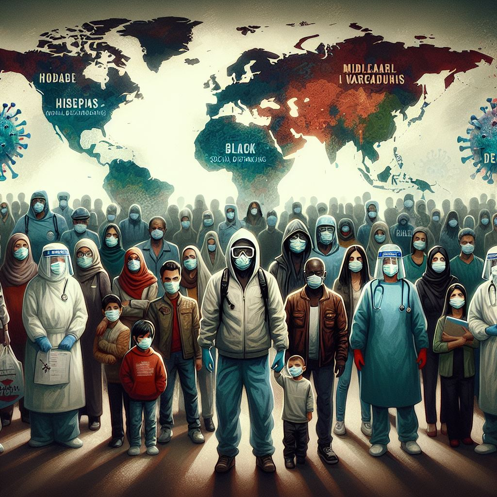

# Análise Exploratória de Dados: Covid-19
 

 <h2>1. Introdução</h2>

<h3><strong>1.1. TLDR</strong></h3>

<ul>
  <li><strong>Dashboard</strong>:
    <ul>
      <li>Google Data Studio <a href="https://lookerstudio.google.com/reporting/08819073-431e-4f2a-b594-16c02177d8a8">link</a></li>
    </ul>
  </li>
  <li><strong>Processamento</strong>:
    <ul>
      <li>Kaggle Notebook <a href="https://www.kaggle.com/fabiopereira445/projeto-ebac-covid19">link</a></li>
    </ul>
  </li>
  <li><strong>Fontes</strong>:
    <ul>
      <li>Casos pela universidade John Hopkins <a href="https://github.com/CSSEGISandData/COVID-19/tree/master/csse_covid_19_data/csse_covid_19_daily_reports">link</a></li>
      <li>Vacinação pela universidade de Oxford <a href="https://covid.ourworldindata.org/data/owid-covid-data.csv">link</a></li>
    </ul>
  </li>
</ul>
 <h3> 1.2 Metas e objetivos</h3>
 
O objetivo principal do projeto é fornecer uma compreensão detalhada do impacto da pandemia no país até 30 de dezembro de 2021, destacando áreas críticas que precisam de intervenção e estratégias recomendadas para mitigar a disseminação do vírus.

<h3><strong>1.3. Pandemia Coronavírus 2019</strong></h3>

<blockquote>
  
A COVID-19 é uma infecção respiratória aguda causada pelo coronavírus SARS-CoV-2, potencialmente grave, de elevada transmissibilidade e de distribuição global. Fonte: Governo brasileiro <a href="https://www.gov.br/saude/pt-br/coronavirus/o-que-e-o-coronavirus">link</a>.

</blockquote>

A disponibilidade de dados sobre a evolução da pandemia no tempo em uma determinada região geográfica é fundamental para o seu combate! Este projeto busca construir um dashboard de dados para exploração e visualização interativa de dados sobre o avanço de casos e da vacinação do Brasil. O processamento de dados está neste <a href="https://www.kaggle.com/fabiopereira445/projeto-ebac-covid19">link</a> e o dashboard, neste <a href="https://lookerstudio.google.com/reporting/08819073-431e-4f2a-b594-16c02177d8a8">link</a>.

 <h2>2.0. Dados</h2>
    </ul>
     
<strong>Os dados sobre casos</strong> da COVID-19 são compilados pelo centro de ciência de sistemas e engenharia da universidade americana John Hopkins (<a href=" https://www.jhu.edu">link</a>). Os dados são atualizados diariamente deste janeiro de 2020 com uma granularidade temporal de dias e geográfica de regiões de países (estados, condados, etc.). O website do projeto pode ser acessado neste <a href="https://systems.jhu.edu/research/public-health/ncov/">link</a> enquanto os dados, neste <a href="https://github.com/CSSEGISandData/COVID-19/tree/master/csse_covid_19_data/csse_covid_19_daily_reports       ">link</a>. Abaixo estão descritos os dados derivados do seu processamento.

    <ul>
    <ul>
        <li>date: data de referência;</li>
        <li>state: estado;</li>
        <li>country: país;</li>
        <li>population: população estimada;</li>
        <li>confirmed: número acumulado de infectados;</li>
        <li>confirmed_1d: número diário de infectados;</li>
        <li>confirmed_moving_avg_7d: média móvel de 7 dias do número diário de infectados;</li>
        <li>confirmed_moving_avg_7d_rate_14d: média móvel de 7 dias dividido pela média móvel de 7 dias de 14 dias atrás;</li>
        <li>deaths: número acumulado de mortos;</li>
        <li>deaths_1d: número diário de mortos;</li>
        <li>deaths_moving_avg_7d: média móvel de 7 dias do número diário de mortos;</li>
        <li>deaths_moving_avg_7d_rate_14d: média móvel de 7 dias dividido pela média móvel de 7 dias de 14 dias atrás;</li>
        <li>month: mês de referência;</li>
        <li>year: ano de referência.</li>
    </ul>
      </ul>
    
<strong>Os dados sobre vacinação</strong> da COVID-19 são compilados pelo projeto Nosso Mundo em Dados (Our World in Data ou OWID) da universidade britânica de Oxford (<a href="https://www.ox.ac.uk">link</a>). Os dados são atualizados diariamente deste janeiro de 2020 com uma granularidade temporal de dias e geográfica de países. O website do projeto pode ser acessado neste <a href="https://ourworldindata.org">link</a> enquanto os dados, neste <a href="https://covid.ourworldindata.org/data/owid-covid-data.csv ">link</a>. Abaixo estão descritos os dados derivados do seu processamento.

    <ul>
    <ul>
        <li>date: data de referência;</li>
        <li>country: país;</li>
        <li>population: população estimada;</li>
        <li>total: número acumulado de doses administradas;</li>
        <li>one_shot: número acumulado de pessoas com uma dose;</li>
        <li>one_shot_perc: número acumulado relativo de pessoas com uma dose;</li>
        <li>two_shots: número acumulado de pessoas com duas doses;</li>
        <li>two_shot_perc: número acumulado relativo de pessoas com duas doses;</li>
        <li>three_shots: número acumulado de pessoas com três doses;</li>
        <li>three_shot_perc: número acumulado relativo de pessoas com três doses;</li>
        <li>month: mês de referência;</li>
        <li>year: ano de referência.</li>
    </ul>
<h2>3.0 Ferramentas utilizadas</h2>

<h3>3.1 Bibliotecas Python utilizadas</h3>
<h4> Manipulação de dados</h4>

<h4> EDA</h4>

O dashboard de dados contém os seguintes gráficos para a análise exploratória de dados (exploratory data analysis ou EDA) interativa:
 <ul> <li>Distribuição do número de casos e mortes ao longo do tempo;</li> <li>Distribuição da média móvel (7 dias) do número de casos e mortes ao longo do tempo;</li> <li>Distribuição geográfica dos casos por estado por dia.</li> </ul>

<h2>4.0 Exploratory Data Analysis</h2>

<strong>Análise dos Dados de COVID-19 no Brasil - 30 de dezembro de 2021</strong>

Caros stakeholders,

Gostaria de compartilhar uma análise detalhada do estado da pandemia de COVID-19 no Brasil, baseada nos dados atualizados até 30 de dezembro de 2021. Nosso objetivo é fornecer insights críticos que ajudarão na tomada de decisões estratégicas. Vejam abaixo os principais pontos da nossa análise:

<strong>1. Vacinação no Brasil</strong>

<ul>
<li>1ª Dose: 77,2% de pessoas vacinadas.</li>
<li>2ª Dose: 66,6% de pessoas vacinadas.</li>
<li>3ª Dose: Apenas 12,3% de pessoas vacinadas.</li>
</ul>

<strong>Análise:</strong>

A disparidade entre as doses administradas mostra a necessidade urgente de intensificar os esforços de vacinação, especialmente para a 3ª dose. A sugestão seria estabelecer uma meta cujo objetivo seja de aumentar rapidamente o número de pessoas totalmente vacinadas, incluindo a dose de reforço, para garantir uma proteção duradoura.

<strong>2. Casos e Mortes</strong>

<ul>
<li>Casos nas Últimas 24h: 14,6 milhões.</li>
<li>Média Móvel de 7 Dias de Casos Confirmados: 14,5 milhões.</li>
<li>Mortes nas Últimas 24h: 423.708.</li>
<li>Média Móvel de 7 Dias de Mortes: 425.553.</li>
</ul>

<strong>Análise:</strong>

Os números no período analisado mostram uma tendência de alta tanto nos casos quanto nas mortes, o que é preocupante. A sugestão seria tomar medidas mais rigorosas de controle de infecções, sendo imperativas para reverter essa tendência.

<strong>3. Tendências</strong>

<ul>
<li>Tendência de Casos: Em junho apresentamos um pico de alta em casos dentro de 24h ultrapassando a marca de 100 MIL Aumento (UPWARD).</li>
<li>Tendência de Mortes: Entre final de Março e Abril registramos um pico de mortes em 24h chegando a máxima de 4148 (UPWARD).</li>
</ul>

<strong>Análise:</strong>

A tendência de aumento contínuo reforça a necessidade de manter e intensificar as medidas de prevenção e controle para evitar a sobrecarga do sistema de saúde e reduzir a mortalidade.

<strong>4. Distribuição Geográfica dos Casos</strong>

O mapa do Brasil incluído no dashboard mostra a distribuição dos casos por estado nas últimas 24h, com uma legenda colorida indicando o número de casos em cada estado.

<strong>Análise:</strong>

Embora o número absoluto de novos casos em São Paulo (19.467) pareça alto, a média móvel de 7 dias de 13,4 mil indica uma tendência de queda. Isso sugere que, apesar do número alto, as novas infecções estão diminuindo gradualmente, o que é um sinal positivo.

<strong>Mortes e Tendências</strong>

<ul>
<li>Mortes nas Últimas 24 Horas: 599</li>
<li>Média Móvel de 7 Dias de Mortes: 507</li>
<li>Tendência de Mortes: STABLE (estabilidade)</li>
</ul>

<strong>Análise:</strong>

São Paulo sendo um dos estados mais populosos está apresentando um maior número de casos. Esse dado sugere a necessidade de alocar mais recursos e reforçar as medidas de controle nessas áreas para conter a disseminação do vírus.

<strong>5. Evolução Temporal dos Casos e Mortes</strong>

O gráfico de linha mostra a evolução dos casos e mortes ao longo do tempo, comparando os dados diários com a média móvel de 7 dias.

<strong>Análise:</strong>

Podemos observar picos significativos durante certos períodos, correlacionando-se com relaxamentos nas medidas de distanciamento social. A reintrodução de restrições pode ser necessária durante esses picos para controlar a transmissão.

<strong>Recomendações</strong>

<ul>
<li><strong>Intensificar a Campanha de Vacinação:</strong> Aumentar a taxa de imunização completa, com foco especial na administração da 3ª dose.</li>
<li><strong>Reforçar Medidas de Controle:</strong> Implementar medidas mais rigorosas de distanciamento social, uso de máscaras e higiene das mãos.</li>
<li><strong>Alocar Recursos para Áreas Críticas:</strong> Direcionar esforços e recursos para os estados mais afetados, conforme indicado pela distribuição geográfica dos casos.</li>
<li><strong>Monitoramento Contínuo:</strong> Manter uma vigilância constante sobre a evolução dos casos e mortes para ajustar rapidamente as estratégias de intervenção.</li>
</ul>

Este dashboard nos fornece uma visão clara e abrangente do estado da pandemia no Brasil no ano de 2021, permitindo que tomemos decisões informadas para proteger a saúde pública e mitigar os impactos socioeconômicos.

Agradeço pela atenção e estou à disposição para quaisquer perguntas ou esclarecimentos adicionais.

Atenciosamente,

<strong>Fabio Pereira 
Analista de Dados 
Vitória-ES 
E-mail: <a href="mailto:fabioalves.js15@gmail.com">fabioalves.js15@gmail.com</a></strong>

</body>
</html>
